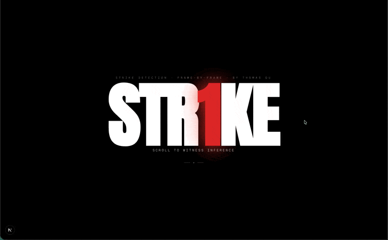
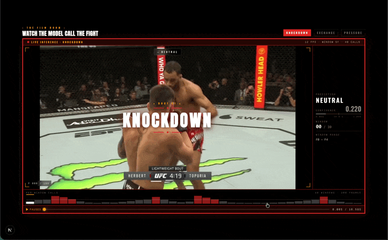
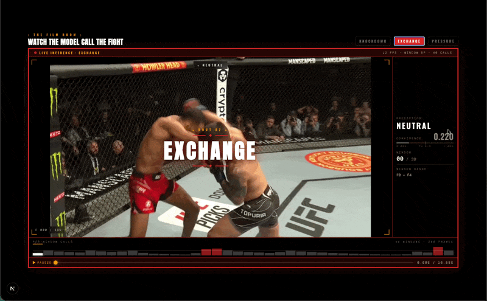
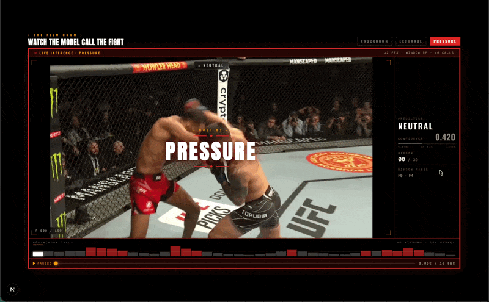

# STR1KE

**Live demo: [str1ke.vercel.app](https://str1ke.vercel.app)**

Strike detection in MMA footage using computer vision and temporal action recognition. A three-stage pipeline segments fighters from broadcast noise, classifies 5-frame windows as strike or neutral, and outputs per-window confidence scores.



## What It Does

Drop in a clip of an MMA fight. The system isolates the fighters from the broadcast (cage, crowd, overlays), then runs inference on every 5-frame window — about 150ms of real time. Each window gets a confidence score between 0 and 1. Above 0.5 is a strike. Below is neutral.

A strike lands in five frames. The model reads all five at once and makes a call.

## The Pipeline

### Round 1 — Segment

SAM2 (Meta's Segment Anything Model 2) strips the broadcast. Prompted once per fighter in the first frame, it propagates masks forward through the entire clip. The output: fighter silhouettes on black. No cage, no crowd, no graphics. The classifier sees motion, not television.

SAM2's streaming memory architecture handles the fast occlusions and overlapping bodies that make MMA footage difficult for traditional segmentation.

### Round 2 — Annotate

38 five-frame windows labeled by hand in Label Studio with a SAM2 backend for mask generation. 19 strikes, 19 neutral. One weekend at a kitchen table.

Each window is a folder of 5 consecutive JPEG frames in MMAction2's RawframeDataset format. Annotation files map paths to frame counts and class labels:

```
strike/0 5 1
neutral/0 5 0
```

Split: 30 train, 6 validation, 2 held-out test.

The dataset is small because Label Studio Premium's ML-assisted labeling (which auto-propagates after a few manual examples) wasn't available. Every mask required manual verification.

### Round 3 — Classify

A Temporal Segment Network (TSN) with a ResNet-50 backbone, pretrained on Kinetics-400 (400 human action classes, ~300K video clips), fine-tuned for binary strike/neutral classification.

TSN works in three steps:

1. **Sample** — takes 5 consecutive frames as one temporal clip
2. **Extract** — each frame passes through the shared ResNet-50 backbone, producing a 2048-dim feature vector
3. **Aggregate** — frame features are averaged into a single representation, then a classification head outputs strike/neutral probabilities

Training ran for 20 epochs on Google Colab's free tier. Under one minute total.







## Why TSN

A 3D CNN was attempted first. It took 4-channel input (RGB + SAM2 mask) to explicitly feed spatial mask data to the network. It never converged — 37.5% validation accuracy across all 20 epochs. With 38 data points, training from scratch couldn't work.

TSN pretrained on Kinetics-400 already understands human body motion, poses, and temporal dynamics from 300K labeled videos. Fine-tuning only adapts the final layer. The backbone does the heavy lifting.

The lesson: with extremely small datasets, transfer learning from a large pretrained model dramatically outperforms training from scratch, even if the from-scratch architecture is theoretically more expressive.

## Key Decisions

**5-frame windows** — At 30fps, 5 frames is ~167ms. A typical MMA strike takes 100-200ms from initiation to landing. The window captures the full action without diluting the signal with neutral movement before or after.

**Binary classification** — 38 labeled windows split across multiple strike types (jab, cross, kick, elbow) would mean ~5 samples per class. Binary strike/neutral is the simplest formulation that still produces a useful signal.

**SAM2 as preprocessing** — Most approaches feed raw video to the classifier and hope it learns to ignore the background. By explicitly removing the background first, the problem simplifies from action recognition in noisy broadcast footage to action recognition on clean silhouettes. This also makes the tiny dataset go further — the model doesn't waste capacity learning what's background vs. fighter.

**Raw frames over video files** — MMAction2's RawframeDataset format allows frame-level preprocessing (applying SAM2 masks per frame) and avoids codec decoding overhead during training.

## Results

The model correctly identifies obvious strikes (clear punches, knockdowns) with high confidence. Transfer learning from Kinetics-400 provides a strong prior on human body motion, and SAM2 segmentation significantly reduces background noise.

Limitations:

- 38 windows is small. The model likely overfits to the source fight (Topuria vs. Holloway) and would struggle with different fighters, weight classes, or camera angles.
- Binary classification can't distinguish strike types.
- Each 5-frame window is classified independently — no temporal context between windows.
- Inference writes temporary video files per window (MMAction2 API constraint), which limits real-time throughput.

## What Would Improve It

More labeled data is the primary bottleneck. Even 200-500 windows would dramatically improve generalization. Beyond that: multi-fight datasets across weight classes, multi-class labels (jab, kick, takedown), and sliding windows with overlap to catch strikes that span window boundaries.

## Tech Stack

| Layer | Tools |
|-------|-------|
| Segmentation | SAM2 (Meta) |
| Annotation | Label Studio + SAM2 backend |
| Framework | MMAction2 (OpenMMLab) |
| Model | TSN (ResNet-50, Kinetics-400 pretrain) |
| Training | PyTorch, Google Colab (free tier) |
| Showcase | Next.js, Tailwind CSS, GSAP |

## Project Structure

```
STR1KE/
├── model/
│   ├── notebooks/
│   │   ├── TSN_Pipeline.ipynb       # TSN fine-tuning + inference
│   │   └── 3DCNN_Pipeline.ipynb     # 3D CNN attempt (abandoned)
│   └── data/
│       ├── annotations/             # train/val/test splits
│       └── frames/
│           ├── strike/              # 19 windows, 5 frames each
│           └── neutral/             # 19 windows, 5 frames each
├── showcase/                        # interactive demo site
│   └── src/
│       ├── app/                     # Next.js pages
│       ├── components/              # scroll hero, film room, upload
│       └── lib/                     # clip data, player utils
├── assets/
│   ├── demos/                       # showcase GIFs
│   └── Mma_pictogram.svg
├── PROJECT_OVERVIEW.md              # deep technical writeup
└── README.md
```

---

Built by Thomas Ou
